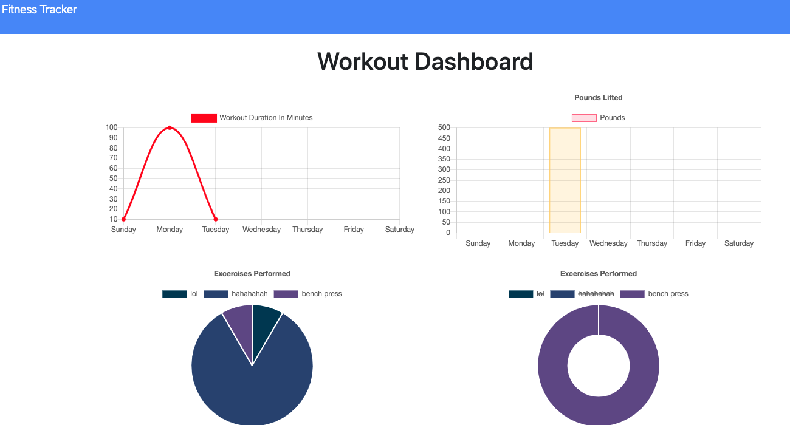

# Fitness Tracker

Table of Contents|
------------------|
Version|
Description|
Installation|
Usage|
Contributors|
Licensing|

## Version:
***

## Description:
***
Full stack web application designed to showcase utility of NoSQL databases (MongoDb).
Several CRUD methods are being used to interact with the database.
Express is used for setting up our server, and routes.
Mongoose is our ODM (object document mapper).

### Preview:

### Built with:

Node.js, MongoDb, Mongoose.js, and Express

## Installation:
>

Visit the deployed link here: https://fitness-tracker032020.herokuapp.com/

>

## Usage:
***
Web app designed to help track exercises in order to obtain fitness goals.

## Contributors:
None

## Licensing:
***

## Creator:
***

## Contact:
***
robin.aguilar@gmail.com

